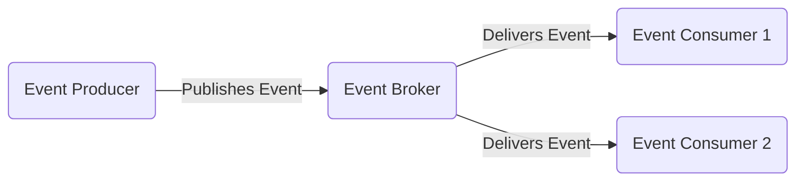

---
tags:
  - architecture
  - event-driven-architecture
  - advanced
links:
source:
aliases:
  - eda
---
> [!toDo] Rewording regarding queue behaviour
> I suggest rewording regarding queues that separate queues are created for consumers and those queues subscribing to a topic will be collecting a copy of the message. Messages for which no queue subscriptions exist are not queued.

Event Driven Architecture describes a concept in IT and software architecture where one or more central brokers are used to decouple applications and enable on-demand transfer of data in the form of messages. In this architecture, messages are sent by a producer to a topic, where they are collected in a queue and can be retrieved and processed by one or multiple consumers. This approach allows applications to react asynchronously to events as they occur, which increases flexibility and supports real-time processing. The broker ensures that messages are reliably routed and delivered, so producers and consumers remain independent from each other. This concept makes it possible to design scalable and resilient systems, as new producers or consumers can be added without changing the core logic of other components.

> [!toDo] Not sure whether roadmap.sh can handle images in .md
> Possibly have to forego the image for copy/pase to roadmap.sh
> 

**Summary**
Event Driven Architecture is a software design model that structures applications around the production, detection and reaction to events. Its key components are event producers, brokers and consumers, creating systems that are scalable and loosely coupled.

**Sources**
- [SAP - What is event-driven architecture?](https://www.sap.com/products/technology-platform/what-is-event-driven-architecture.html)
- [SAP Learning - Explaining Event-Driven Architecture](https://learning.sap.com/learning-journeys/discovering-event-driven-integration-with-sap-integration-suite-advanced-event-mesh/explaining-event-driven-architecture_d02a51bb-1ce4-4c2d-a25d-8b9c9198ffd2)