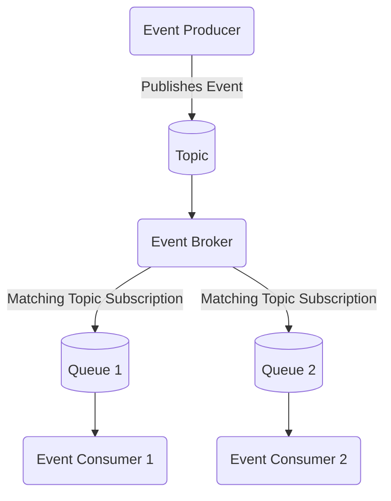

---
tags:
  - architecture
  - event-driven-architecture
  - advanced
links:
source:
aliases:
  - eda
---
Event Driven Architecture describes a concept in IT and software architecture where one or more central brokers are used to decouple applications and enable on-demand transfer of data in the form of messages. In this architecture, messages are sent by a producer to a topic managed by the broker. For each consumer that subscribes to this topic, the broker creates a separate queue. Each of these queues receives a copy of the message, which ensures that multiple consumers can process the same event independently. Consumers then retrieve and process messages from their own queue. If no subscriptions exist for a topic, no queue is created and the message is not stored. This approach allows applications to react asynchronously to events as they occur, increasing flexibility and enabling real-time processing. The broker ensures reliable routing and delivery, so producers and consumers remain independent from each other. This concept makes it possible to design scalable and resilient systems, as new producers or consumers can be added without changing the core logic of other components.

**Sources**
- [SAP - What is event-driven architecture?](https://www.sap.com/products/technology-platform/what-is-event-driven-architecture.html)
- [SAP Learning - Explaining Event-Driven Architecture](https://learning.sap.com/learning-journeys/discovering-event-driven-integration-with-sap-integration-suite-advanced-event-mesh/explaining-event-driven-architecture_d02a51bb-1ce4-4c2d-a25d-8b9c9198ffd2)