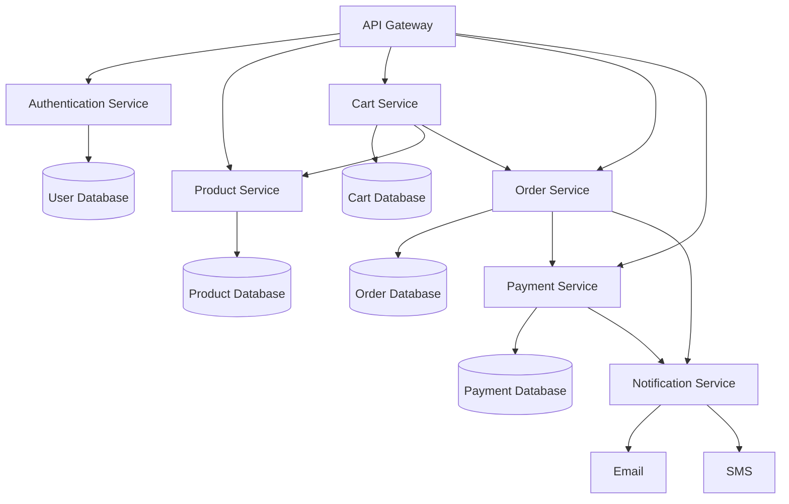

---
tags:
  - architecture
  - basic
links:
source:
aliases:
  - microservice architecture
---

> [!toDo] Spell out the relevance to CAP
> Please emphasize the fact that a CAP app is a microservices based application where UI, Connectivity, Authentication, Persistence and applcation logic are all services that interact through service bindings.

A microservice architecture is an approach to software development where an application is built as a collection of small, independent services. Each service runs in its own process, is responsible for a specific business function, and communicates with other services through lightweight mechanisms like [[REST API]]s. This architecture allows teams to develop, deploy, and scale services independently, increasing flexibility and accelerating the development process. Unlike monolithic applications, microservices enable individual components to be updated without affecting the entire system.

**Example E-Commerce Microservice Project**

