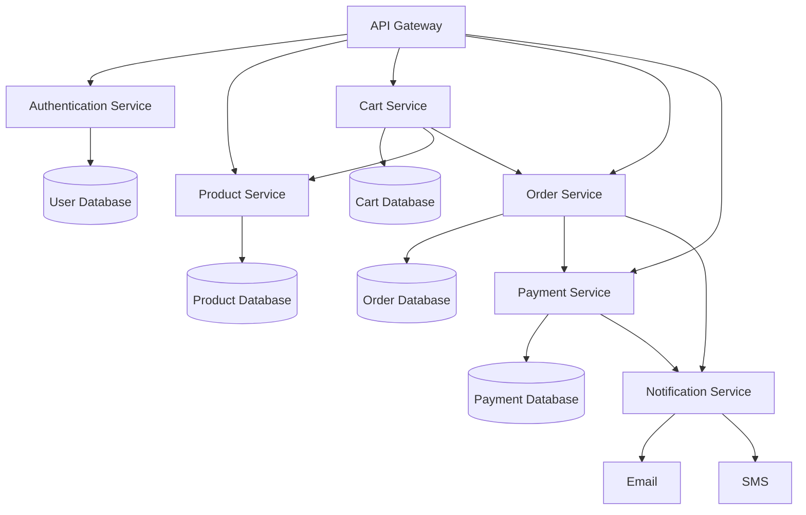

---
tags:
  - architecture
  - basic
links:
source:
aliases:
  - microservice architecture
---

A microservice architecture is an approach to software development where an application is built as a collection of small, independent services. Each service runs in its own process, is responsible for a specific business function, and communicates with other services through lightweight mechanisms like [[REST API]]s. This architecture allows teams to develop, deploy and scale services independently, increasing flexibility and accelerating the development process. Unlike [[monolithic]] applications, [[microservices]] enable individual components to be updated without affecting the entire system.

In the context of the [[SAP Capire]], this architectural style is highly relevant since a [[SAP Capire|CAP]] application is itself composed of [[microservices]]. Core aspects such as the user interface, connectivity, authentication, persistence and the application logic are implemented as distinct services that interact with each other through service bindings. This separation of concerns ensures that each part of the application remains independent and can evolve at its own pace while still integrating seamlessly within the overall solution. [[CAP]] thus leverages microservices principles to provide a modular foundation for building scalable, enterprise-grade applications.

**Summary**  
Microservice architecture builds applications as independent services. In CAP this is directly reflected, as UI, connectivity, authentication, persistence and business logic are separate services connected through service bindings, supporting modularity and scalability.

**Example E-Commerce Microservice Project**

